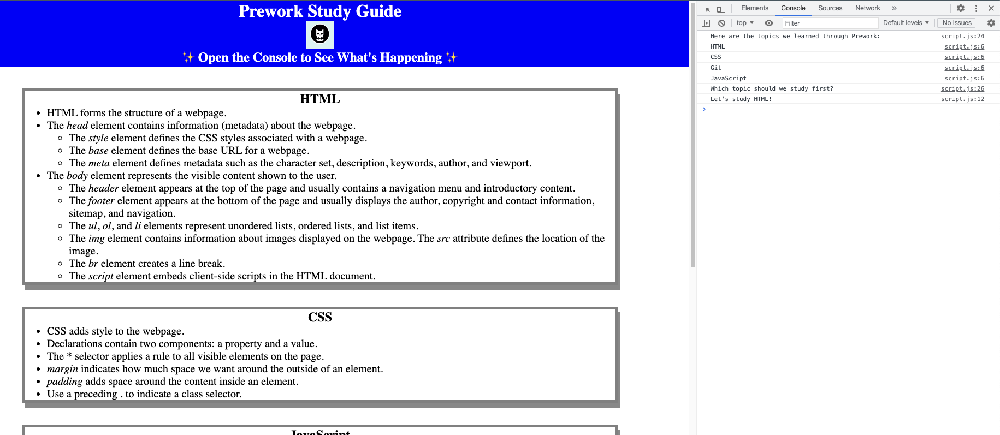

# Prework Study Guide Webpage

## Description

This Prework Study Guide captures some basic information about the cornerstone technologies used in web development today. 

This simple project acts as a demonstration of the absolute basics of HTML, CSS, and JavaScript in action and was created to help me get familiar with the development process (including Git, coding best practices, and other need-to-knows).

For personal interest, I will revisit this project as a reference to reflect back on once I have completed the coding bootcamp.

## Installation

N/A

## Usage

This Prework Study Guide provides brief introductory notes about web development and comprises the following topics: HTML, CSS, JavaScript, and Git. Feel free to dive further into each topic through other resources. All points of information are listed under appropriate topic headings--and each topic is encased in a border for visual clarity.

Don't know where to start? Open the Chrome Dev Tools console (via Command + Option + b) to have a script choose a topic of study for you. Refresh the page to rerun the script.

## Credits

N/A

## License

Please refer to the LICENSE in the repo.
